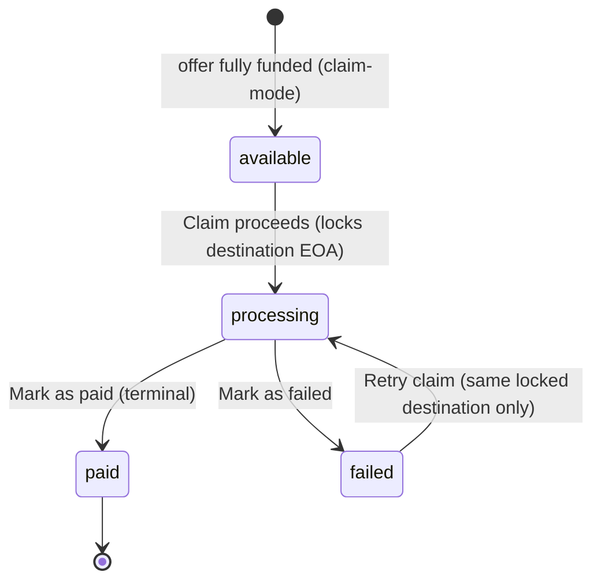

# 06 - Data Model

**Purpose:** Entities, money, and lifecycle for the Direct / Pay demo.
**Last updated:** August 20, 2026 (Base Sepolia / Base Mainnet)

## 1. Money

- Store USD as integer cents. No floats in the pricing or payment path.
  Field names such as `amountXcgCents` are a leftover from the earlier
  XCG book; the values are USD cents.
- Store USDC as integer atomic units with six decimals.
  `usdcAtomic = usdCents * 10_000` (1:1 with USD).
- Direct operations screens show **XCG** at **1 USD = 1.79 XCG**.
  Pay shows XCG as the primary value and USDC as the settlement amount.
- Round fees half-up to the cent.

MRA-001 Pay conversion: USD 1,800 → 1,800,000,000 atomic → **1,800.00 USDC**.

## 2. Pricing

```
gross_receivables = monthly_rent × months
fee               = round_half_up(gross × fee_rate)
purchase_price    = gross − fee
```

Effective annualised cost is the IRR of “cash in at t=0, rent forgone at
t=1…N”, then `(1+i)^12 − 1`. If that value is above **0.24**, no offer is
created. There is no override.

MRA-001 locked result: rent 180000 cents, 6 months, 5.50% → fee 59400,
purchase 1020600, effective ≈ 21.57%.

Pricing inputs: monthly rent, term, **Listing Score**, **Payer Score**,
related-party flag. Property Score is not an input.

## 3. Property Score

```
rentToMarketRatio = contractualMonthlyRent / estimatedMarketMonthlyRent
```

Lower is more favourable. Multipliers:

- ratio <= 0.70 → 1.10
- ratio > 0.70 and <= 0.85 → 1.05
- ratio > 0.85 and <= 1.00 → 1.00
- ratio > 1.00 and <= 1.15 → 0.95
- ratio > 1.15 → 0.90

```
propertyScore = clamp(round(clamp(listingScore, 0, 100) * multiplier), 0, 100)
```

Missing, zero, negative, or non-finite market rent uses multiplier 1.00 and
an explicit “market data unavailable” state.

Examples: Listing Score 80 and ratio 0.60 → Property Score 88. Listing
Score 95 and ratio 0.60 caps at 100.

## 4. Entities

Series → Offer (transaction) → Receivables / Collections / Releases /
Documents / Holders / Payment requests / Distributions / Ledger
transactions.

Offer also has Property, Lease, Payer file, Listing Score (`passport.total`),
and checklist.

Stable demo IDs include `accountId`, `offerId`, `propertyId`, `receivableId`,
`paymentRequestId`, `positionId`, `collectionId`, `distributionId`,
`transactionId`, optional `txHash`, and `safeAccountId`. Do not call any
field a token ID in the UI. `externalTokenId` may exist as null.

`property` series type exists on `ra_series` so the platform is not
hardcoded to receivables. It is not implemented.

### Settlement mode and landlord proceeds claim

- **`SettlementMode`** = `"automatic" | "landlord_claim"` on each Offer.
  Missing historical mode normalizes to `automatic`.
- **`OfferFundingRecord`** = the mocked business allocation created once
  when a claim-mode offer is fully funded (UI wording **“Mock funding
  recorded”**). Fields: `fundingRecordId`, `offerId`, `offerReference`,
  `category: "offer_purchase"`, `railMode: "mock"`, `safeAddress`,
  `purchasePriceCents`, `amountUsdcAtomic`, `status: "recorded"`,
  `createdAt`. It is **not** an on-chain transfer receipt and never implies
  one.
- **`LandlordProceedsClaim`** = the mocked claim on sale proceeds. Fields:
  `claimId`, `offerId`, `offerReference`, `landlordId`, `feeCents`,
  `claimableCents`, `destinationEoa` (unverified demo EOA), `status`,
  `transactionId`, `txHash` (always `null`), `createdAt`, `paidAt`.
- **Optional party payout addresses** — `Party.eoaAddress` and
  `HolderPosition.eoaAddress` are server-only, unverified demo addresses.
  They are never serialised to purchaser, payer, or landlord screens.
- **Money invariant for the claim** —
  `claimableCents = purchasePriceCents = offeringCents = fundedCents =
  grossReceivables − fee`. The existing `feeCents` is informational and is
  **never deducted twice**.

### Landlord claim lifecycle

`available → processing → paid` (also `failed`). `paid` is terminal and
never duplicates ledger/events. Only a paid claim writes the mocked
`landlord_proceeds_claim` ledger row; `txHash` stays `null` (no fake chain
evidence). A claim-mode offer never records an automatic
`advance_settlement` during normalization. Retries go only to the locked
`destinationEoa`; a different address is rejected once processing begins.



## 5. Lifecycle

`draft → under_review → funding → live/collecting → closed`  
`default` is an arrears outcome, not a shortcut.

Payment request: `due → initiated → pending → confirmed` (also failed,
overdue, expired, already paid). Confirmed is distinct from the first click.

Stage 0 is a hard gate. Dual-control release requires two different people.

Draft, under-review, and unfunded offers are not counted as money already
advanced or receivables already sold.

## 6. Anonymisation

Purchaser serialisation may include district, grades, Property Score, term.
It may not include tenant name, employer, address, contact, or exact income.
Marketplace and portfolio pages load that anonymised shape only.

Payer serialisation may include rent, dates, USDC amount, and a fictional
receiving address. It may not include fee, purchase price, holders, or
distribution economics.

## 7. Persistence

The walkthrough stores the entire `DemoBook` as JSON in `ra_demo_state`.
New fields must default via `normalizeBook()` so an older payload does not
crash. `offerFundingRecords` and `landlordProceedsClaims` are optional book
arrays that default to empty on older payloads. `cryptoConfig` is
catalog-owned (network, chain ID, native USDC,
explorer). Older `optimism` and OP Sepolia books rematch to **Base
Sepolia**. Reset restores the complete current seed and keeps the
selected payment network. No new migration for this pivot.
